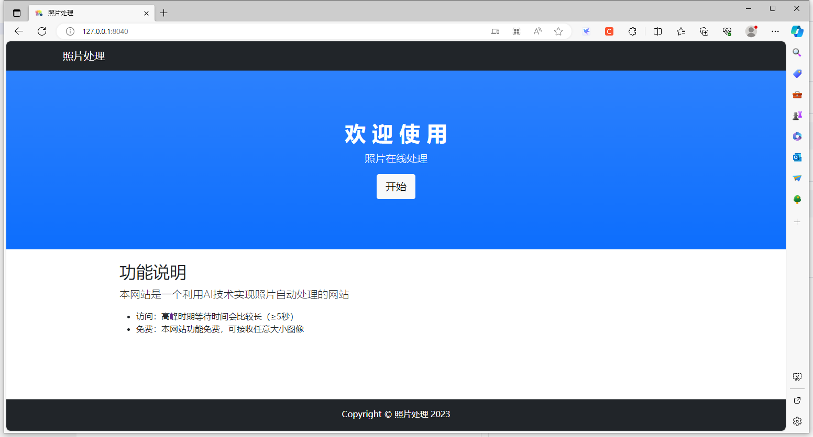
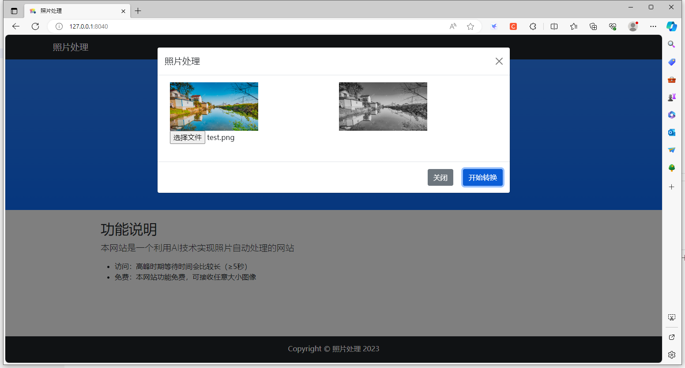

# clean_fastapi_demo
一个干净的fastapi版demo，用于在线图像处理。前端采用Bootstrap5进行页面设计，后端采用fastapi框架，图像处理部分使用了opencv-python库。

# 使用方法

## 安装fastapi
```
pip install fastapi "uvicorn[standard]" python-multipart
pip install opencv-python
```
## 启动
```
uvicorn main_fastapi:app --host 0.0.0.0 --port 8040
```

启动成功后通过浏览器访问：http://127.0.0.1:8040/

# 运行效果
初始页面：

<div align="center">
 
</div>

单击页面“开始”按钮，进入照片处理界面，上传一张照片，然后单击“开始转换”按钮，效果如下：
<div align="center">
 
</div>


**本项目完成照片灰度转换功能，旨在提供一个简单干净的fastapi示例用于串通前后端处理逻辑。**